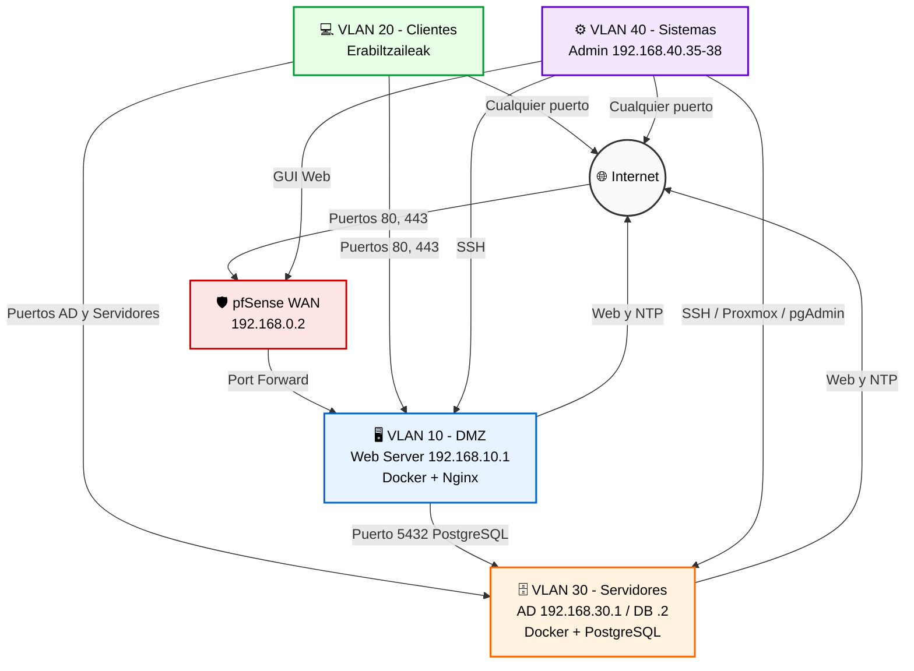

# 🛡️ Documentación de Red y Sistemas — Erronka 1 (Talde 2)


## 📖 Descripción General

Este repositorio contiene la documentación técnica y la arquitectura de la infraestructura de red y sistemas para el **Reto 1: Asentando las bases** (Proyecto Erronka 1 - Talde 2, Eskola).

El objetivo es desplegar una arquitectura de red segmentada, bastionada y monitorizada. La infraestructura está diseñada para alojar los servicios del proyecto (sitio web, base de datos, gestión de usuarios y cursos) de forma segura, aplicando medidas de prevención, concienciación y respuesta ante incidentes.

### 🛠️ Stack Tecnológico

*   **Virtualización:** Proxmox VE 9.2.2 (Nodo `talde2`)
*   **Red y Seguridad:** MikroTik (Router de borde), pfSense (Firewall y enrutamiento inter-VLAN)
*   **Servidores:** Windows Server 2019 (AD/DNS), Ubuntu Server (Servicios)
*   **Servicios y Contenedores:** Docker, Nginx (Web), PostgreSQL (Base de Datos)
*   **Directorio Activo:** `talde2.eus`

---

## 🗺️ Arquitectura de Red

### Diagrama de Topología Lógica



### Direccionamiento IP y VLANs

| VLAN ID | Nombre | Subred (CIDR) | Gateway | DHCP | Propósito |
| :---: | :--- | :--- | :--- | :---: | :--- |
| **10** | DMZ | 192.168.10.0/24 | 192.168.10.254 | No | Servidor Web (Docker/Nginx) |
| **20** | Erabiltzaileak | 192.168.20.0/24 | 192.168.20.254 | Sí | Clientes / Equipos de aula |
| **30** | Zerbitzariak | 192.168.30.0/24 | 192.168.30.254 | No | Servidores (AD, Docker/PostgreSQL) |
| **40** | Sistemak | 192.168.40.0/24 | 192.168.40.254 | No | Administración y Sistemas |

### Dispositivos de Red

| Hostname | Tipo | Fabricante / Modelo | IP gestión | Ubicación | Firmware | Rol |
| :--- | :--- | :--- | :--- | :--- | :--- | :--- |
| **MikroTik** | Router/Switch | MikroTik | 192.168.0.254 | Rack | RouterOS | Borde / NAT |
| **pfSense** | Firewall | Netgate (VM) | 192.168.0.2 | Proxmox | pfSense CE | Firewall / Enrutador |
| **Proxmox** | Hipervisor | Proxmox VE 9.2.2 | 192.168.0.1 | Rack | 9.2.2 | Virtualización |

### Enrutamiento y Conmutación

*   **Enrutamiento:** Estático entre VLANs gestionado por pfSense.
*   **NAT:** MikroTik realiza NAT (masquerade) hacia Internet.
*   **VLAN Trunking:** Configurado 802.1Q en MikroTik (Eth3) y pfSense (vtnet1).

---

## 💻 Sistemas e Infraestructura de Cómputo

### Inventario de Servidores y Máquinas Virtuales

| Hostname | Rol | SO | IP | CPU / RAM / Disco | Entorno | Ubicación |
| :--- | :--- | :--- | :--- | :--- | :--- | :--- |
| **WinServerTald2** | AD / DNS | Win Server 2019 | 192.168.30.1 | 4 vCPU / 16 GB / 99.4 GB | PROD | Proxmox (VM 101) |
| **Ubu-Server-Web** | Web (Docker/Nginx) | Ubuntu | 192.168.10.1 | 2 vCPU / 4 GB / 20 GB | DMZ | Proxmox (VM 102) |
| **Ubu-Server-DB** | BD (Docker/PostgreSQL) | Ubuntu | 192.168.30.2 | 2 vCPU / 8 GB / 30 GB | PROD | Proxmox (VM 103) |
| **PfSense** | Firewall | FreeBSD | 192.168.0.2 | 2 vCPU / 4 GB / 20 GB | PROD | Proxmox (VM 100) |

### Aplicaciones y Servicios

| Aplicación | Versión | Servidor | Puerto | URL | Criticidad |
| :--- | :--- | :--- | :--- | :--- | :--- |
| **Nginx (proxy inverso)** | Alpine (Docker) | Ubu-Server-Web | 80, 443 | https://192.168.74.60 | Alta |
| **Matrículas (Laravel)** | - | Ubu-Server-Web | 9000 (interno, PHP-FPM) | - (tras Nginx) | Alta |
| **PostgreSQL (Docker)** | PostgreSQL 16 | Ubu-Server-DB | 5432 | - | Alta |
| **pgAdmin** | 4 (latest) | Ubu-Server-DB | 5050 | http://192.168.30.2:5050 | Media |
| **Active Directory (AD DS/DNS)** | Win Server 2019 | WinServerTald2 | 53, 88, 123, 135, 389, 445, 464, 636, 3268-3269, 49152-65535 | - | Alta |

---

## 🔒 Seguridad y Firewall

### Matriz de Comunicación (Origen ➔ Destino)

| Origen \ Destino | Internet (WAN) | pfSense (GUI/DNS) | VLAN 10 (DMZ) | VLAN 20 (Clientes) | VLAN 30 (Servidores) | VLAN 40 (Sistemas) | Proxmox (gestión) |
| :--- | :---: | :---: | :---: | :---: | :---: | :---: | :---: |
| **Internet** | - | ❌ | ✅ **80, 443** (Web) | ❌ | ❌ | ❌ | ❌ |
| **pfSense** | ✅ | - | ✅ | ✅ | ✅ | ✅ | ✅ |
| **VLAN 10 (DMZ)** | ✅ **80, 443, 123** | ⚠️ Solo DNS (53) | - | ❌ | ✅ **5432** (Web a DB) | ❌ | ❌ |
| **VLAN 20 (Clientes)** | ✅ **Cualquiera** | ⚠️ Solo DNS (53) | ✅ **80, 443** (Web) | - | ✅ **AD, Web, Servidores** | ❌ | ❌ |
| **VLAN 30 (Servidores)** | ✅ **80, 443, 123** | ⚠️ Solo DNS (53) | ❌ | ❌ | - | ❌ | ❌ |
| **VLAN 40 (Sistemas)** | ✅ **Cualquiera** | ✅ **GUI (Admin)** | ✅ **SSH** (Admin) | ❌ | ✅ **SSH, pgAdmin** (Admin) | - | ✅ **Web/SSH** (Admin) |

*   ✅ **Permitido** (con puertos específicos indicados si aplica).
*   ❌ **Bloqueado** (explícita o implícitamente por reglas de denegación).
*   ⚠️ **Permitido solo para servicios específicos** (ej. DNS hacia pfSense).
*   **Admin** = Solo permitido desde las IPs de administración (`ADMIN_HOSTS`: 192.168.40.35-38).
*   **Proxmox** (192.168.0.1) está en la red de gestión/tránsito, fuera de las 4 VLANs — no forma parte de la VLAN 30 (Servidores).

### Políticas de Seguridad Implementadas

*   **Segmentación Estricta:** Por defecto, las VLANs no pueden comunicarse entre sí a menos que exista una regla explícita.
*   **VLAN 40 (Sistemas):** Única VLAN con privilegios de administración (GUI pfSense, SSH, Proxmox).
*   **VLAN 20 (Clientes):** Acceso web a DMZ y servicios esenciales de AD, sin administración de infraestructura.
*   **VLAN 10 (DMZ):** Servidor web aislado. Solo puede salir a Internet y conectar a BD en VLAN 30.
*   **VLAN 30 (Servidores):** Solo salida a Internet (Web y NTP) y respuesta a conexiones entrantes.
*   **Internet ➔ DMZ:** Acceso entrante estrictamente limitado a puertos 80 y 443.
*   **Anti VLAN-hopping:** Puertos de acceso del MikroTik restringidos a tráfico untagged de su propia VLAN (`frame-types` + `ingress-filtering`).

---

## 🛠️ Operación y Soporte

### Procedimientos Operativos
*   Arranque y parada ordenada de las VMs en Proxmox.
*   Despliegue de contenedores Docker en `Ubu-Server-Web` y `Ubu-Server-DB`.
*   Gestión de usuarios y GPOs en Active Directory (`talde2.eus`).
*   Restauración de copias de seguridad.

### Copias de Seguridad
*   **Proxmox:** Snapshots y backups completos en almacenamiento `local` y `local-lvm`.
*   **PostgreSQL:** Backups programados dentro del contenedor Docker.

### Riesgos y Deuda Técnica
*   **R-01:** Dependencia de un único host Proxmox (SPOF - Single Point of Failure).
*   **R-02:** Contenedores Docker sin orquestación (Kubernetes/Swarm) para alta disponibilidad.

---

## 📂 Estructura del Repositorio

```text
/
├── README.md                 # Este archivo
├── docs/                     # Documentación detallada en Word/PDF
│   ├── Documentacion_Red_y_Sistemas_ES.docx
│   └── Documentacion_Red_y_Sistemas.docx
├── diagrams/                 # Diagramas de red y arquitectura
│   ├── topologia.png
│   └── mikrotik_interfaces.png
├── backups/                  # Backups de Pfsense y Mikrotik
│   └── Backups-20261003T130145Z-1-001.zip
└── docker/                   # Archivos de docker
    ├── db/
    │   └── docker-compose.yml
    └── web/
        ├── docker-compose.yml
        └── Dockerfile
```

---