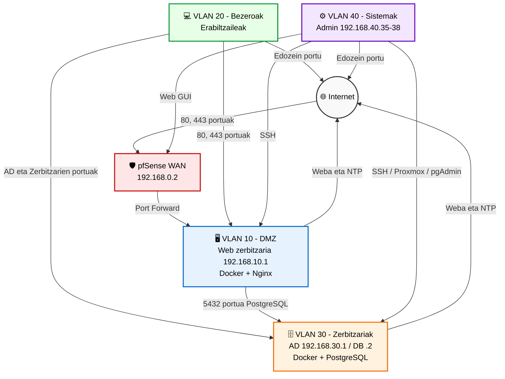

# 🛡️ Sare eta Sistemen Dokumentazioa — Erronka 1 (Talde 2)


## 📖 Deskribapen orokorra

Biltegi honek **Erronka 1: Oinarriak ezartzen** erronkarako (Erronka 1 - Talde 2 proiektua, Eskola) sare- eta sistema-azpiegituraren dokumentazio teknikoa eta arkitektura biltzen ditu.

Helburua sare-arkitektura segmentatu, gotortu eta monitorizatu bat hedatzea da. Azpiegitura proiektuaren zerbitzuak (webgunea, datu-basea, erabiltzaileen eta ikastaroen kudeaketa) modu seguruan ostatatzeko diseinatuta dago, prebentzio-, kontzientziazio- eta gorabeheren aurkako erantzun-neurriak aplikatuz.

### 🛠️ Stack teknologikoa

*   **Birtualizazioa:** Proxmox VE 9.2.2 (`talde2` nodoa)
*   **Sarea eta segurtasuna:** MikroTik (ertzeko routerra), pfSense (firewall-a eta VLAN arteko bideratzea)
*   **Zerbitzariak:** Windows Server 2019 (AD/DNS), Ubuntu Server (zerbitzuak)
*   **Zerbitzuak eta edukiontziak:** Docker, Nginx (Web), PostgreSQL (datu-basea)
*   **Active Directory:** `talde2.eus`

---

## 🗺️ Sare-arkitektura

### Topologia logikoaren diagrama



### IP helbideratzea eta VLANak

| VLAN ID | Izena | Azpisarea (CIDR) | Gateway | DHCP | Helburua |
| :---: | :--- | :--- | :--- | :---: | :--- |
| **10** | DMZ | 192.168.10.0/24 | 192.168.10.254 | Ez | Web-zerbitzaria (Docker/Nginx) |
| **20** | Erabiltzaileak | 192.168.20.0/24 | 192.168.20.254 | Bai | Bezeroak / Ikasgelako ekipoak |
| **30** | Zerbitzariak | 192.168.30.0/24 | 192.168.30.254 | Ez | Zerbitzariak (AD, Docker/PostgreSQL) |
| **40** | Sistemak | 192.168.40.0/24 | 192.168.40.254 | Ez | Administrazioa eta Sistemak |

### Sare-gailuak

| Hostname | Mota | Fabrikatzailea / Eredua | Kudeaketa-IPa | Kokalekua | Firmware | Eginkizuna |
| :--- | :--- | :--- | :--- | :--- | :--- | :--- |
| **MikroTik** | Router/Switch | MikroTik | 192.168.0.254 | Rack | RouterOS | Ertza / NAT |
| **pfSense** | Firewall | Netgate (VM) | 192.168.0.2 | Proxmox | pfSense CE | Firewall-a / Bideratzailea |
| **Proxmox** | Hipervisorea | Proxmox VE 9.2.2 | 192.168.0.1 | Rack | 9.2.2 | Birtualizazioa |

### Bideratzea eta konmutazioa

*   **Bideratzea:** VLAN arteko bideratze estatikoa, pfSense-k kudeatua.
*   **NAT:** MikroTik-ek NAT (masquerade) egiten du Internetera begira.
*   **VLAN Trunking:** 802.1Q konfiguratuta MikroTik-en (Eth3) eta pfSense-n (vtnet1).

---

## 💻 Sistemak eta konputazio-azpiegitura

### Zerbitzarien eta makina birtualen inbentarioa

| Hostname | Eginkizuna | SE | IP | CPU / RAM / Diskoa | Ingurunea | Kokalekua |
| :--- | :--- | :--- | :--- | :--- | :--- | :--- |
| **WinServerTald2** | AD / DNS | Win Server 2019 | 192.168.30.1 | 4 vCPU / 16 GB / 99.4 GB | PROD | Proxmox (VM 101) |
| **Ubu-Server-Web** | Web (Docker/Nginx) | Ubuntu | 192.168.10.1 | 2 vCPU / 4 GB / 20 GB | DMZ | Proxmox (VM 102) |
| **Ubu-Server-DB** | DB (Docker/PostgreSQL) | Ubuntu | 192.168.30.2 | 2 vCPU / 8 GB / 30 GB | PROD | Proxmox (VM 103) |
| **PfSense** | Firewall | FreeBSD | 192.168.0.2 | 2 vCPU / 4 GB / 20 GB | PROD | Proxmox (VM 100) |

### Aplikazioak eta zerbitzuak

| Aplikazioa | Bertsioa | Zerbitzaria | Portua | URL | Kritikotasuna |
| :--- | :--- | :--- | :--- | :--- | :--- |
| **Nginx (alderantzizko proxya)** | Alpine (Docker) | Ubu-Server-Web | 80, 443 | https://192.168.74.60 | Altua |
| **Matrikulak (Laravel)** | - | Ubu-Server-Web | 9000 (barnekoa, PHP-FPM) | - (Nginx atzean) | Altua |
| **PostgreSQL (Docker)** | PostgreSQL 16 | Ubu-Server-DB | 5432 | - | Altua |
| **pgAdmin** | 4 (latest) | Ubu-Server-DB | 5050 | http://192.168.30.2:5050 | Ertaina |
| **Active Directory (AD DS/DNS)** | Win Server 2019 | WinServerTald2 | 53, 88, 123, 135, 389, 445, 464, 636, 3268-3269, 49152-65535 | - | Altua |

---

## 🔒 Segurtasuna eta firewall-a

### Komunikazio-matrizea (Jatorria ➔ Helmuga)

| Jatorria \ Helmuga | Internet (WAN) | pfSense (GUI/DNS) | VLAN 10 (DMZ) | VLAN 20 (Bezeroak) | VLAN 30 (Zerbitzariak) | VLAN 40 (Sistemak) | Proxmox (kudeaketa) |
| :--- | :---: | :---: | :---: | :---: | :---: | :---: | :---: |
| **Internet** | - | ❌ | ✅ **80, 443** (Weba) | ❌ | ❌ | ❌ | ❌ |
| **pfSense** | ✅ | - | ✅ | ✅ | ✅ | ✅ | ✅ |
| **VLAN 10 (DMZ)** | ✅ **80, 443, 123** | ⚠️ DNS soilik (53) | - | ❌ | ✅ **5432** (Web-etik DB-ra) | ❌ | ❌ |
| **VLAN 20 (Bezeroak)** | ✅ **Edozein** | ⚠️ DNS soilik (53) | ✅ **80, 443** (Weba) | - | ✅ **AD, Weba, Zerbitzariak** | ❌ | ❌ |
| **VLAN 30 (Zerbitzariak)** | ✅ **80, 443, 123** | ⚠️ DNS soilik (53) | ❌ | ❌ | - | ❌ | ❌ |
| **VLAN 40 (Sistemak)** | ✅ **Edozein** | ✅ **GUI (Admin)** | ✅ **SSH** (Admin) | ❌ | ✅ **SSH, pgAdmin** (Admin) | - | ✅ **Web/SSH** (Admin) |

*   ✅ **Baimendua** (portu zehatzak adierazita, aplikatzen bada).
*   ❌ **Blokeatua** (esplizituki edo inplizituki, ukatze-arauen bidez).
*   ⚠️ **Zerbitzu zehatzetarako soilik baimendua** (adib. DNS pfSense-rantz).
*   **Admin** = Administrazio-IPetatik soilik baimendua (`ADMIN_HOSTS`: 192.168.40.35-38).
*   **Proxmox** (192.168.0.1) kudeaketa/trantsizio-sarean dago, 4 VLANen kanpo — ez da 30. VLANaren (Zerbitzariak) parte.

### Ezarritako segurtasun-politikak

*   **Segmentazio zorrotza:** Lehenespenez, VLANek ezin dute elkarrekin komunikatu arau esplizitu bat egon ezean.
*   **VLAN 40 (Sistemak):** Administrazio-pribilegioak dituen VLAN bakarra (pfSense GUI-a, SSH, Proxmox).
*   **VLAN 20 (Bezeroak):** DMZ-rako web-sarbidea eta AD-ren funtsezko zerbitzuak, azpiegituraren administraziorik gabe.
*   **VLAN 10 (DMZ):** Web-zerbitzari isolatua. Internetera irten eta 30. VLANeko DBra konektatu baino ezin du.
*   **VLAN 30 (Zerbitzariak):** Internetera irteera soilik (Weba eta NTP) eta sarrerako konexioei erantzuna.
*   **Internet ➔ DMZ:** Sarrerako sarbidea 80 eta 443 portuetara zorrozki mugatua.
*   **VLAN hopping-aren aurkakoa:** MikroTik-eko sarbide-portuak beren VLANeko untagged trafikora mugatuta (`frame-types` + `ingress-filtering`).

---

## 🛠️ Eragiketa eta euskarria

### Eragiketa-prozedurak
*   VMen abiarazte eta geldiarazte ordenatua Proxmox-en.
*   Docker edukiontzien hedapena `Ubu-Server-Web` eta `Ubu-Server-DB` zerbitzarietan.
*   Erabiltzaileen eta GPOen kudeaketa Active Directory-n (`talde2.eus`).
*   Babeskopien berreskuratzea.

### Babeskopiak
*   **Proxmox:** Snapshot-ak eta babeskopia osoak `local` eta `local-lvm` biltegiratzean.
*   **PostgreSQL:** Docker edukiontziaren barruan programatutako babeskopiak.

### Arriskuak eta zor teknikoa
*   **R-01:** Proxmox ostalari bakarraren mendekotasuna (SPOF - Single Point of Failure).
*   **R-02:** Docker edukiontziak orkestraziorik gabe (Kubernetes/Swarm), erabilgarritasun handirako.

---

## 📂 Biltegiaren egitura

```text
/
├── README.md                 # Fitxategi hau
├── docs/                     # Dokumentazio xehatua Word/PDF formatuan
│   ├── ES
│   │   ├── Documentacion_Red_y_Sistemas.pdf
│   │   └── Documentacion_Red_y_Sistemas.docx
│   └── EU
│       ├── Dokumentazioa_Sarea_eta_Sistemak.pdf
│       └── Dokumentazioa_Sarea_eta_Sistemak.docx
├── diagrams/                 # Sare- eta arkitektura-diagramak
│   ├── topologia.png
│   └── mikrotik_interfaces.png
├── backups/                  # pfSense eta MikroTik-en babeskopiak
│   └── Backups-20261003T130145Z-1-001.zip
├── docker/                   # Docker fitxategiak
│   ├── db/
│   │   └── docker-compose.yml
│   └── web/
│       ├── docker-compose.yml
│       └── Dockerfile
└── images/
    ├── ActiveDirectory.png
    ├── ...
    ...
```

---